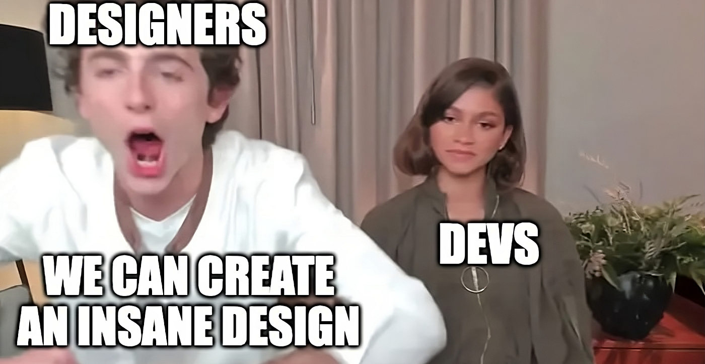

#appwrite #posts

If you're a frontend developer, you know that one of the scariest tasks you can receive is coding a complex web animation. If you're not a frontend developer, I bet that sounds even harder.

Don't get me wrong, I love web animations! They are an elegant way to show off some flair in your website when used correctly. And unlike traditional animation media, they can even be interacted with, giving it a bit of personal flair.

But animating on the web also has its limitations, and the challenges they make you face can be quite daunting. So when our _amazing_ design team shared me previews for the [new animations TODO: Link to Caio's post?] that I'd be working on, I started thinking they didn't like me very much.



I jest, I was super stoked! The animations looked fantastic. But I'm not joking when I say that they were much more challenging than I initially thought.

## What are we animating?

First things first, what was I supposed to animate? Well, in this article, I'll be mainly talking about this animation, that's present at [Appwrite's homepage](https://appwrite.io).!


_TODO: Improve the video_

There's a lot of stuff going on in there! There are multiple sections, each one with possible interactivity, and there's also animation **between** the sections, where the phone moves positions.

There's a lot to digest here, so let's break this into parts. We need to code:

- The logic that activates a section based on the scroll position
- Each individual section's animation
- How to animate between sections

Let's get into it!

P.S. The code for the website, including animations, can be found at https://github.com/appwrite/website/.

## Excuse me, scrolling through!

Scroll-based animations are quite common. There are two types. Animations that start when you scroll to a certain section, and animations that progress together with your scroll. For our animations, we're using the former.

We have 5 sections in our animation, as showcased in our video (we technically have 2 more, one for the beginning and one for the end), and they're pretty similar. They are all in a really tall container, so that we have ample space to scroll through, but the animations themselves always stick to the center of the screen.


I've split said container into 5 **equal** parts, each part representing a section. All the sections are always sticking to the center of the screen as I said, but, once the top of the viewport passes a section trigger, the respective section is active, and all the other sections are de-activated.

I decided to create a helper function that, given an HTML element, returns what percentage has been traversed. With that, I can apply the function to our `AnimationContainer`, and determine what's the active section. E.g. since the triggers are at `0%`, `20%`, `40%`, `60%` and `80%`, if we've already traversed `50%` of the viewport, Then I know that the third section is the one that's active.

For the curious minds, here's what the function looks like:

```typescript
import type { Action } from "svelte/action";

export type ScrollInfo = {
  percentage: number;
  traversed: number;
  remaning: number;
};

export const scroll: Action<
  HTMLElement,
  undefined,
  {
    "on:aw-scroll": (e: CustomEvent<ScrollInfo>) => void;
    "on:aw-resize": (e: CustomEvent<ScrollInfo>) => void;
  }
> = (node) => {
  function getScrollInfo(): ScrollInfo {
    const { top, height } = node.getBoundingClientRect();
    const { innerHeight } = window;

    const scrollHeight = height - innerHeight;
    const scrollPercentage = (-1 * top) / scrollHeight;

    const traversed = scrollPercentage * scrollHeight;
    const remaning = scrollHeight - traversed;

    return {
      percentage: scrollPercentage,
      traversed,
      remaning,
    };
  }

  const handleScroll = () => {
    node.dispatchEvent(
      new CustomEvent<ScrollInfo>("aw-scroll", {
        detail: getScrollInfo(),
      })
    );
  };

  const handleResize = () => {
    node.dispatchEvent(
      new CustomEvent<ScrollInfo>("aw-resize", {
        detail: getScrollInfo(),
      })
    );
  };

  handleScroll();
  handleResize();

  window.addEventListener("scroll", handleScroll);
  window.addEventListener("resize", handleResize);

  return {
    destroy() {
      window.removeEventListener("scroll", handleScroll);
      window.removeEventListener("resize", handleResize);
    },
  };
};
```

You'll notice however, that this is not **just** a regular function. It's a [Svelte Action](https://svelte.dev/docs/svelte-action). From the docs:

> Actions are functions that are called when an element is created. They can return an object with a `destroy` method that is called after the element is unmounted.

In practice, what this means is, given this syntax:

```html
<div id="products" use:scroll on:aw-scroll={(e) => scrollInfo = e.detail}>
	<!-- ... -->
</div>
```

The function will automatically run with the given `div` being passed in as the `node` parameter. And whenever that `div` is unmounted from the DOM, the destroy function will be run. This allows us to easily create reusable functions that directly interact with the DOM with almost no boilerplate!
